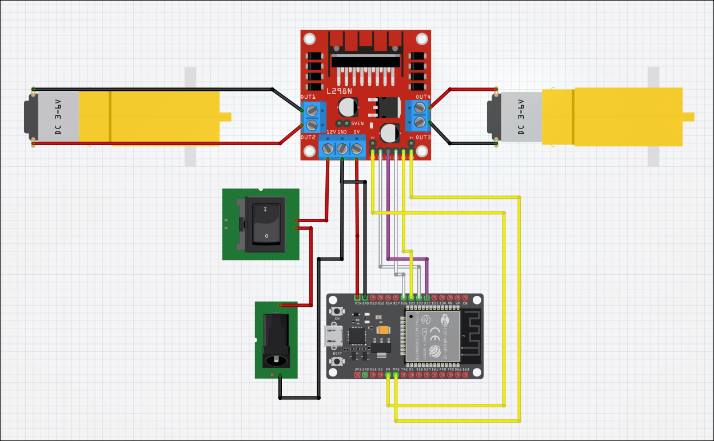
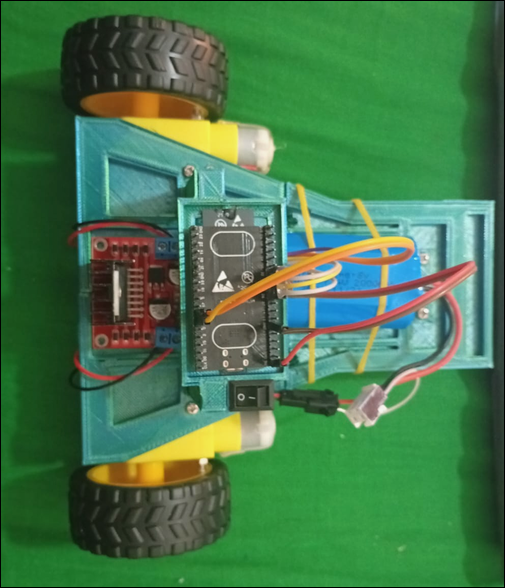
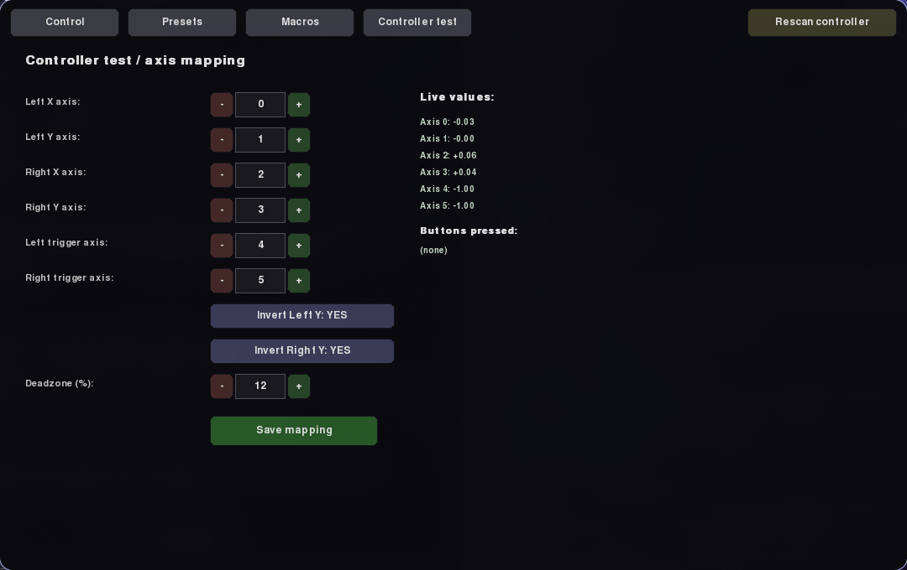

# ESP32 Robot Dashboard

So you want to build a simple Robot with a ESP32 you arrive to the right place.

## Description

This is a configurable dashboard to control a simple 2 wheel robot powered by ESP32.

---

## Hardware



To build this you'll need:
* ESP32 = 1
* L298N Motor Driver = 1
* Yellow Arduino DC Motors = 2
* Switch = 1
* 7.4V Battery (or 12V) = 1
* Battery Connector = 1

> **WARNING:** Battery management was not tested with 12V and the schematic does not show how to make a proper voltage divider. Please research before connecting it.



This is a photo of the whole thing assembled. To get the 3D models, go to the `3D_models` directory in this repository.

---

## Dashboard

Control dashboard built in Python 3 using Pygame.

### Requirements & Installation

```bash
# Create and activate virtual environment
python -m venv venv
source venv/bin/activate  # On Linux/macOS
# venv\Scripts\activate   # On Windows

# Install dependencies
pip install pygame-ce
```

### Running the Dashboard

1. Connect your PC to the `RobotESP32` WiFi network.
2. Connect a gamepad/controller (USB or Bluetooth) to your PC.
3. Start the application:

```bash
cd dashboard
python3 main.py
```

### Dashboard Screens

#### Main Interface
This is the main interface of the dashboard, it will give you real-time telemetry of the robot, wheel direction/speed status, active preset, and active macro state.

| Idle State | Moving State |
| :---: | :---: |
| .png) | .png) |

---

#### Control Presets & Mapping
Select, create, edit, or delete control mapping presets. Each mapping translates a gamepad input range `[in_min..in_max]` to a target motor PWM range `[out_min..out_max]`. Multiple inputs can target the same motor (e.g., throttle + steering).

| Preset Selection | Editing Mappings |
| :---: | :---: |
| .png) | .png) |

**Built-in Presets:**
1. **Tank:** Each stick controls one wheel independently.
2. **Split Arcade:** One stick controls drive (Y-axis), the other controls steering (X-axis).
3. **Triggers + Steering:** Right trigger accelerates forward, left trigger accelerates in reverse, and one stick steers.
4. **Single Stick:** Full drive and steering assigned to a single analog stick.

---

#### Macros & Autonomous Sequences
Create custom movement sequences assigned to controller buttons. Each step defines `{motor: L/R/BOTH, speed, duration ms}`. 

| Macro List | Editing Sequence |
| :---: | :---: |
| .png) | .png) |

* **Single Trigger Mode:** Runs the entire sequence once when pressed.
* **Hold Mode:** Aborts execution if the button is released before completion.

---

#### Controller Test & Calibration
Displays raw real-time axis and button values from connected gamepads to identify axis indices, adjust deadzones, invert Y-axes, and calibrate controls.



---

## Firmware (`esp32_firmware/robot_firmware.ino`)

- **Wiring Used:**
  - Left motor: `PWM1=GPIO16`, `IN1=GPIO33`, `IN2=GPIO32`
  - Right motor: `PWM2=GPIO4`, `IN3=GPIO26`, `IN4=GPIO25`
- **ESP32 WiFi Access Point:**
  - **SSID:** `RobotESP32`
  - **Password:** `robot1234`
  - **Robot IP:** `192.168.4.1`
- Flash using the Arduino IDE with board **"ESP32 Dev Module"**. Compatible with ESP32 Arduino core v3.x `ledc` API (`ledcAttach` / `ledcWrite`).
- **UDP Protocol (Port 4210):**
  - **PC -> Robot:** `L:<-255..255>,R:<-255..255>\n`
  - **Robot -> PC:** `T:up=...,rssi=...,l=...,r=...,batt=...,clients=...\n`
- **Watchdog:** Stops the motors automatically if no command arrives within 500 ms.

---

## Config Files (`dashboard/config/`)

All parameters are persisted as plain JSON files:

* **`settings.json`**: Robot IP/port address and command transmission frequency (Hz).
* **`controller_map.json`**: Axis index mappings, Y-axis inversion, and gamepad deadzones.
* **`presets.json`**: Saved mapping presets and active selection.
* **`macros.json`**: Saved macro sequences.

---

## Notes

- The position/orientation shown in the silhouette is only a dead-reckoning estimate — there are no encoders or IMU, so it will drift over time.
- If you switch to a different gamepad model, recalibrate your axis mappings from the **Controller test** screen.
